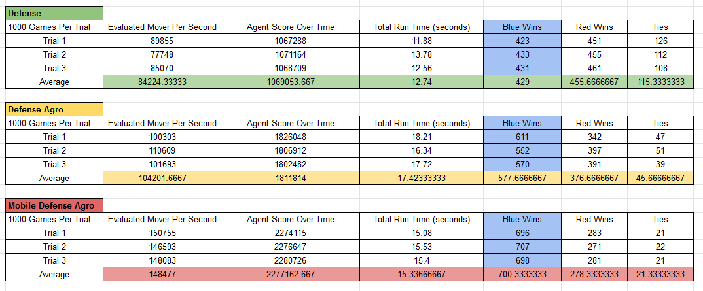
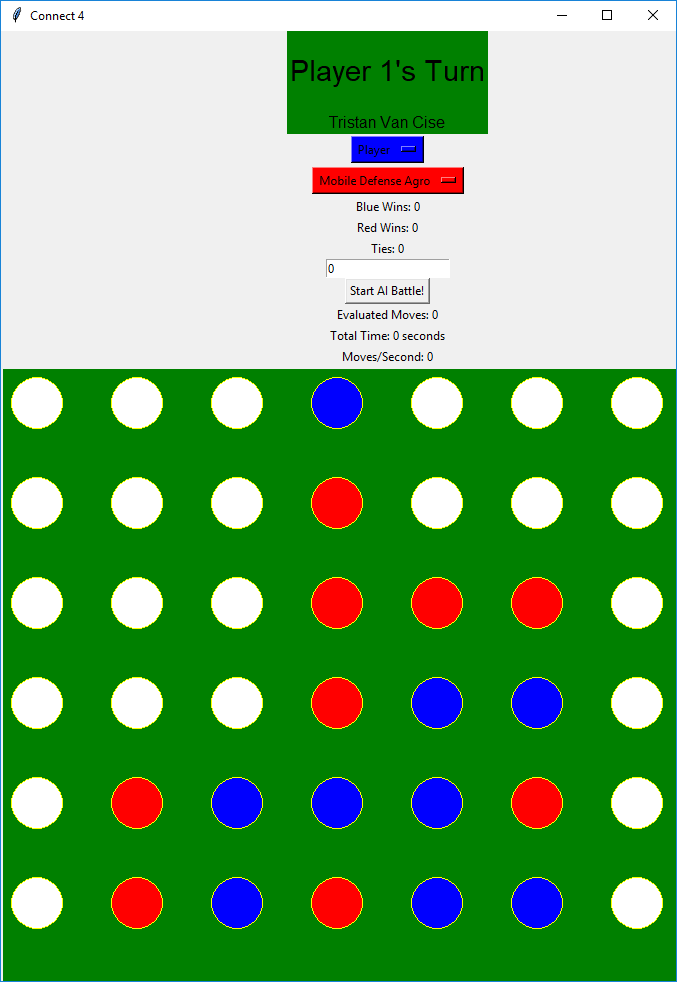
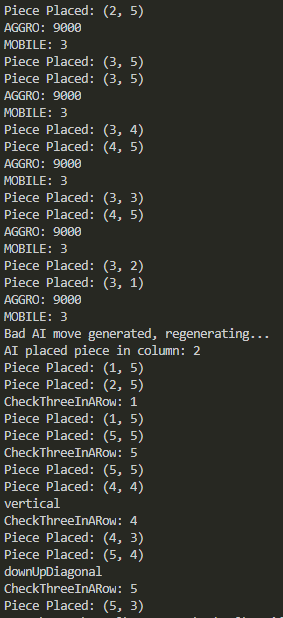

# Connect4
Play connect 4 against some breadth first search oriented AI!

## Report

Three trials were carried out for each AI. Blue always represents the AI the statistics correspond to. Red always represents the control group, which is a 'Defense AI' that blocks three in a rows.

### AI Types
- **Defense** - Blocks three in a rows, otherwise uses random moves.
- **Defense Agro** - Blocks three in a rows and forces a win if it has a three in a row, otherwise uses random moves.
- **Mobile Defense Agro** - Blocks three in a rows and forces a win if it has a three in a row, otherwise places pieces in the most mobile locations i.e. locations that open up the most options for future moves.

### [Statistics](https://docs.google.com/spreadsheets/d/1WFtJvH4xyIPUyRgYX3VY5aSd5MTep_LCcQxXsL9Izck/edit?usp=sharing)
[](https://docs.google.com/spreadsheets/d/1WFtJvH4xyIPUyRgYX3VY5aSd5MTep_LCcQxXsL9Izck/edit?usp=sharing)

### Sample GUI Output



#### Notes
* The "Start AI Battle!" button only works when two AIs are matched against eachother.
* If you are a player, all you need to do to start playing is click a column on the board.
* Individual AIvAI games can be stepped through by clicking on the board instead of pressing the "Start AI Battle!" button.
* Blue goes first. Red goes second.

### Sample CLI Output



#### Notes
* ```CheckThreeInARow``` corresponds to the AI deciding to play defensively and block the player from winning.
  * The type of win the AI is blocking is specified directly above the ```CheckThreeInARow``` print out.
  * Example of blocking a vertical three in a row in column 5:
  ``` 
    vertical
    CheckThreeInARow: 5
  ```
* ```AGGRO``` corresponds to the AI making an aggresive move to advance its win condition
  * Example of the AI completing a four in a row in column 1:
  ```
    AGGRO: 1
  ```
* ```MOBILE``` corresponds to the AI placing a piece in a location with as many adjacent slots open as possible.
  * Example of the AI placing a mobile piece in column 3:
  ```
    MOBILE: 3
  ```
  
  ### Bugs
  * Don't play as ```player``` for red team, its clunky.
  * The code is disgusting :)
  * Probably a lot more :D
